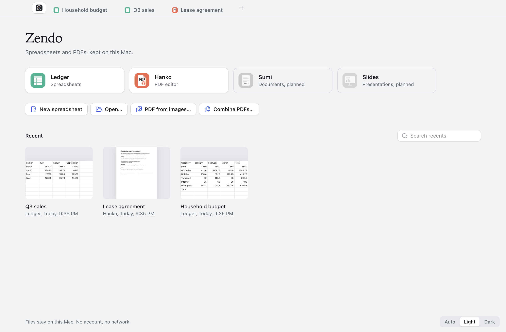
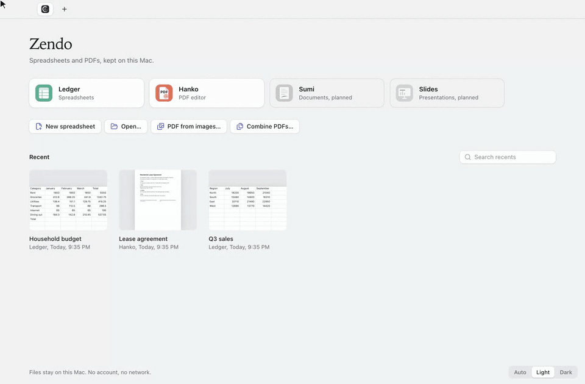
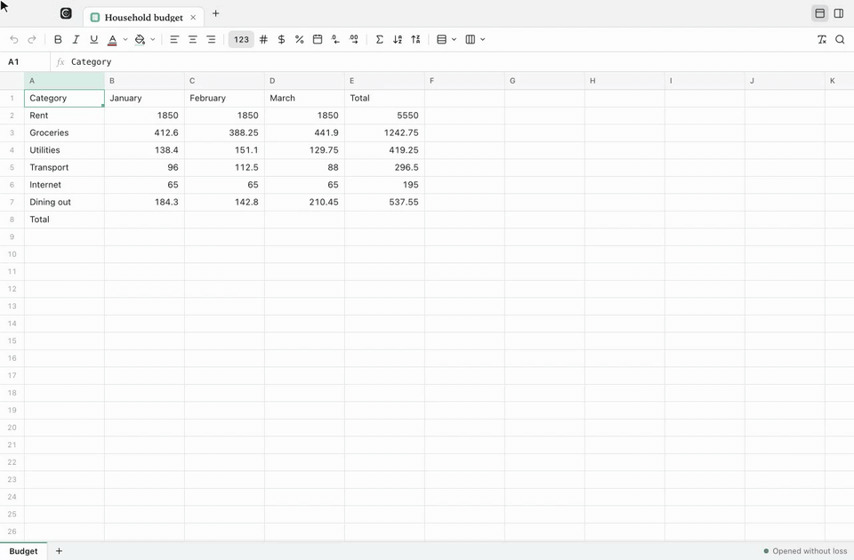
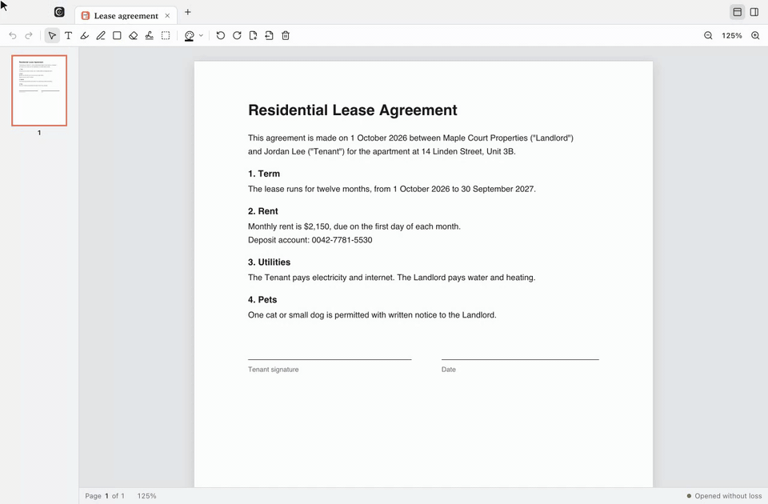

# Zendo

Spreadsheets and PDFs for the Mac. Files stay on your Mac: no account, no network.

Zendo covers the everyday jobs, not every feature of Microsoft Office. It opens Excel workbooks, CSV files and PDFs, lets you edit them, and saves them back in the same formats so other people can open them.



## How it is organised

Zendo is one window with tabs. A spreadsheet and a PDF can sit side by side in the same tab row, so a task that needs both, such as filling in a form from a budget, stays in one place.

- **Home** is the pinned first tab (⇧⌘H). It starts new files, opens existing ones, and lists recent files with previews.
- **Every other tab is a file.** Its icon shows which application edits it. The toolbar, the inspector and the menu bar follow the active tab: a spreadsheet brings the Format menu, a PDF brings the Page menu.
- **Tabs group by kind.** A new spreadsheet opens after the last spreadsheet tab and a PDF after the last PDF, so the row reads as groups. You can still drag any tab anywhere.
- **More windows when you want them.** ⇧⌘N opens a new window. Right-click a tab and choose **Move to New Window** to put two files next to each other.
- **Tabs come back.** Quitting remembers each window's open files and reopens them on the next launch.



## Applications

| Application | For | Opens | Saves | Status |
|---|---|---|---|---|
| **Ledger** | Spreadsheets | `.xlsx`, `.xlsm`, `.csv` | `.xlsx`, `.csv` | Available |
| **Hanko** | PDF editing | `.pdf` (and `.png` / `.jpg` into a new PDF) | `.pdf` | Available |
| **Sumi** | Documents | `.docx`, `.md` | — | Planned |
| **Slides** | Presentations | `.pptx` | — | Planned |

### Ledger



- **Formulas.** Excel-style formulas (`=SUM(B2:B7)`, `=VLOOKUP(…)`, references across sheets) recalculate as you type.
- **Formatting.** Bold, italic, underline, text and fill colour, alignment, and number formats (number, currency, percent, date, decimal places). A file's own number formats, such as euros or `dd/mm/yyyy` dates, are written back unchanged unless you change them.
- **Data tools.** Sort by a column, AutoSum, find and replace across all sheets, freeze rows and columns, insert, delete or hide rows and columns, and named ranges.
- **Inspector.** ⌥⌘I opens a side panel with the selection's sum, average, minimum and maximum, plus the cell's format and freeze settings.
- **Safe saving.** When a workbook uses something Ledger can't represent (for example charts or macros), Ledger says so when the file opens and lists it in an import report. Saving then goes to Save As, so the original file is never overwritten with less than it had.
- **Macro-enabled workbooks (`.xlsm`)** open with their data, formulas and formatting. Macros are not kept: Ledger warns when the file opens, and saving makes a new `.xlsx` copy.

### Hanko



- **Mark up.** Text, highlight, freehand drawing, rectangles and white-out.
- **Sign.** Draw a signature once with the trackpad or mouse. Zendo keeps it on this Mac so you can place it on any PDF.
- **Fill forms.** Type into a PDF's own form fields and tick its checkboxes.
- **Redact.** True redaction, the way Adobe Acrobat Pro applies it: everything under a box is removed from the file, not covered. Text under the box is deleted, the covered pixels of images are blanked, and drawings under the box are dropped. Form fields, links and comments touching a box are removed with their values. The rest of the page stays real, selectable text. Copies that can hide outside the page are cleared too: the page's stored thumbnail and the accessibility text of redacted pages.
- **Remove hidden information.** When you save redactions, Zendo offers to also remove the document title and author, bookmarks, attached files, comments and scripts, like Acrobat's Remove Hidden Information. It is on by default. Hidden layers are not removed yet.
- **Pages.** Rotate, delete, insert pages from another PDF, and extract a page to its own file.
- **From Home.** Combine several PDFs into one, or turn photos (`.png`, `.jpg`) into a PDF.

### Sumi (planned)

Documents: open, edit and save Word (`.docx`) and Markdown (`.md`) files. The planned scope is the common set: headings, paragraphs and lists, bold, italic and links, tables, images, and export to PDF. Not started yet; the Home card is shown as planned.

### Slides (planned)

Presentations: open and present PowerPoint (`.pptx`) files, then edit text and reorder slides. Not started yet; the Home card is shown as planned.

## Roadmap

In order, with the next item first:

1. **Print and Export as PDF** (⌘P) in Ledger and Hanko.
2. **More spreadsheet formats.** Open and save `.tsv`; open `.xls` (Excel 97–2003), Apple `.numbers` and LibreOffice `.ods`, saving them as `.xlsx`.
3. **Ledger, second tier:** borders and text wrap, filters, conditional formatting, dropdown lists, charts, and row numbers that skip hidden rows.
4. **Search in PDFs** (⌘F in Hanko).
5. **iPhone photos (`.heic`)** in PDF from images.
6. **Sumi**, for documents (`.docx`, Markdown, plain text and `.rtf`).
7. **Signed and notarized builds**, so Zendo can be downloaded and run on other Macs without building it.
8. **Slides**, for presentations (`.pptx`).
9. **Windows support.** The same app, not a separate version. Electron already runs it on Windows; the work is only what it needs to run and fit there: a Windows target in the packaging config, no title-bar space reserved for the Mac window buttons, Ctrl instead of ⌘ in labels and tooltips, and wording such as "Show in Explorer" instead of "Show in Finder".

Not planned: binary workbooks (`.xlsb`) and other macro-enabled formats, and Apple Pages or Keynote files.

## Install

Zendo is built from source. It targets macOS on Apple silicon.

**Requirements:** [Node.js](https://nodejs.org) 22.13 or newer and [pnpm](https://pnpm.io) 10.

```sh
git clone https://github.com/Zedyas/zen-forge.git
cd zen-forge
pnpm install
pnpm package:mac
```

The app is written to `dist/mac-arm64/Zendo.app`. Drag it into `/Applications`.

The build has an ad-hoc signature, which is enough to run it on the Mac that built it. Running it on other Macs needs an Apple Developer ID certificate and notarization.

**Make Zendo the default app for a file type:** in Finder, select a `.xlsx` or `.pdf` file, press ⌘I, choose Zendo under **Open with**, then click **Change All…**.

## Keyboard shortcuts

Every command is also in the menu bar and in the command palette (⌘K). Hover any toolbar button to see its name and shortcut.

| Tabs and windows | |
|---|---|
| ⇧⌘H | Home |
| ⌘1 … ⌘8 | Go to tab 1 to 8 (Home is tab 1) |
| ⌘9 | Go to the last tab |
| ⌃Tab / ⌃⇧Tab, or ⇧⌘] / ⇧⌘[ | Next / previous tab |
| ⌘W | Close tab (on Home, closes the window) |
| ⇧⌘N / ⇧⌘W | New window / close window |
| ⌘K | Command palette |

| Files and editing | |
|---|---|
| ⌘N | New spreadsheet |
| ⌘O | Open |
| ⌘S / ⇧⌘S | Save / Save As |
| ⌘Z / ⇧⌘Z | Undo / Redo |
| ⌥⌘T | Show or hide the toolbar |
| ⌥⌘I | Show or hide the inspector |

| Ledger | |
|---|---|
| ⌘B / ⌘I / ⌘U | Bold / Italic / Underline |
| ⌘F | Find and replace |

| Hanko | |
|---|---|
| V · T · H · D · R · W | Select, Text, Highlight, Draw, Rectangle, White-out |
| S · X | Signature, Redact |
| ⌘L / ⌘R | Rotate page left / right |
| ⌘⌫ | Delete page |
| ⌘= / ⌘- / ⌘0 | Zoom in / Zoom out / Actual size |

## Development

```sh
pnpm dev          # run the app with hot reload
pnpm test         # unit tests (Vitest)
pnpm typecheck    # TypeScript, strict mode
pnpm lint         # ESLint, zero warnings allowed
pnpm build        # production build into out/
pnpm package:mac  # build and package Zendo.app into dist/
```

### How it is built

- **Electron** runs the app. The main process (`electron/main`) owns windows, the native menu bar, file dialogs, file reads and writes, and the saved session. Every window loads the same React page; a window is a row of tabs that starts on Home.
- **The renderer** (`src/renderer/src`) is React 19 with Zustand stores. One store holds the window's tabs; each tab records which application edits it. The renderer reaches the file system only through the `window.desktop` bridge defined in `electron/preload`, and a lint rule keeps that bridge inside `services/file`.
- **Commands** are defined once in `src/shared/commands.ts`. The native menu, the command palette, keyboard shortcuts and toolbar tooltips all read from that list, and each command says which kind of tab it applies to.
- **Editors** (`modules/sheets`, `modules/pdf`) each export a handler with `run`, `save` and `release`. The shell finds the handler by the tab's kind, so saving or closing a tab works whether or not its editor is on screen.
- **Ledger** uses [HyperFormula](https://hyperformula.handsontable.com) for formulas, [Glide Data Grid](https://grid.glideapps.com) to draw the grid, [ExcelJS](https://github.com/exceljs/exceljs) for `.xlsx`, and [Papa Parse](https://www.papaparse.com) for `.csv`.
- **Hanko** uses [pdf.js](https://mozilla.github.io/pdf.js/) to draw pages, [pdf-lib](https://github.com/cantoo-scribe/pdf-lib) to write every change back into the file, and [MuPDF](https://mupdf.com) to apply redactions. MuPDF's WebAssembly module loads only when a redaction is saved.

```text
electron/
  main/        windows, menus, file access, settings and session
  preload/     the window.desktop bridge
src/
  shared/      applications, commands and types used by both processes
  renderer/src/
    app/       the window, tabs, Home, commands, document actions
    ui/        shared components: tabs, toolbar, inspector, tooltips, icons
    services/  file access, recent files, previews
    modules/
      sheets/  Ledger: workbook model, file formats, grid, toolbar
      pdf/     Hanko: PDF engine, pages, markup, signatures, forms
scripts/       suite-icon.mjs generates the app icon (pnpm icon:generate)
patches/       a fix for Glide Data Grid, applied by pnpm install
build/         the app icon used for packaging
```

The patch in `patches/` makes Glide Data Grid load its cell editor up front instead of on first use. Without it, the first key typed into a cell is sometimes dropped.

## Contributing

Issues and pull requests are welcome on [GitHub](https://github.com/Zedyas/zen-forge).

- **Reporting a bug:** say what you did, what you expected and what happened. Attach the file if you can share it, or describe what is in it (formulas, form fields, redactions).
- **Before a pull request:** run `pnpm typecheck`, `pnpm lint` and `pnpm test`, and add a focused test when you fix a bug in a model, a file format or the PDF engine.
- **Scope:** Zendo aims at the everyday jobs, not feature parity with Microsoft Office. The [roadmap](#roadmap) lists what is planned; for anything larger, open an issue first.

## License

Copyright © 2026 Zed Y.

Zendo is licensed under the [GNU General Public License v3.0](LICENSE) (`GPL-3.0-only`). You can use, study, change and share it; if you distribute Zendo or a modified version, you must share its source under the same license.

It uses GPL-3.0 because the formula engine, HyperFormula, is GPL-3.0, and a packaged `Zendo.app` includes it. Using one license for both keeps the source and the app under the same terms.

Redaction uses MuPDF, which is licensed under the GNU Affero General Public License v3.0 (AGPL-3.0). AGPL-3.0 and GPL-3.0 can be combined; MuPDF keeps its own license inside the app. AGPL adds one rule beyond GPL: if you run a modified MuPDF for users over a network, you must offer them its source. A desktop app like Zendo is not affected. The other dependencies use permissive licenses (MIT, and Apache-2.0 for pdf.js) that are compatible with GPL-3.0.
